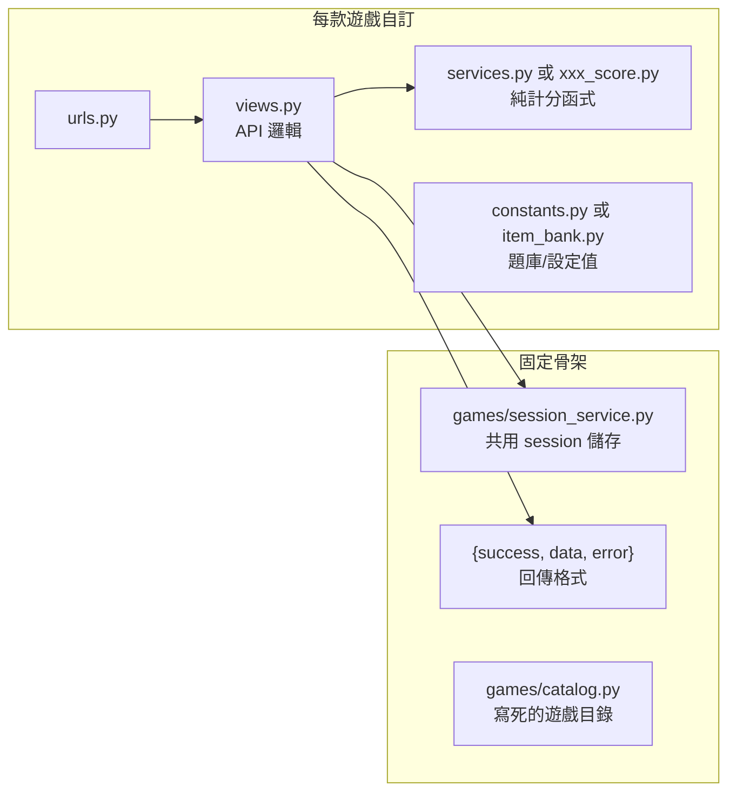

# 遊戲後端共用架構

> 專案：憶智防線（LightMemory）
> 適用範圍：`games/` App 底下所有遊戲（目前：market_route、market_shopping、market_sort）
> 目的：讓新遊戲照同一套架構開發，但保留玩法自由度
> 文件版本：1.0 初稿
> 文件日期：2026-09-18

## 1. 文件目的

三款遊戲（菜市場找路、市場買菜、整理菜籃遊戲）玩法完全不同，但後端有一套共通的骨架：**怎麼存 session、怎麼回傳資料、怎麼放設定值**。這份文件把「三個遊戲都一樣」跟「三個遊戲可以不一樣」的部分分開列出來，之後開發第 4、第 5 款遊戲時，照這份文件對照，架構上就會跟現有三款一致，玩法可以完全自訂。

---

## 2. 骨架總覽



新遊戲要做的事只有右邊四個檔案；左邊三個是共用的，直接呼叫、不用重寫。

---

## 3. 每款遊戲的資料夾結構（固定慣例）

```
games/
  <game_name>/
    __init__.py
    urls.py           # 這款遊戲自己的路由
    views.py           # API 邏輯，呼叫 session_service 存取 session
    services.py         # 純函式：計分、驗證邏輯，不碰 request/session（可選但建議有）
    constants.py 或 item_bank.py   # 題庫、選項、參數等設定值（可選）
    serializers.py      # 有「一次送整批資料」的 API 才需要（可選，見第 6 節）
    tests*.py           # 測試
```

`<game_name>` 用 snake_case，同時也是 `session_service` 裡的 `game_type` 字串（見第 4 節）。

新遊戲要接進系統，還要動兩個地方：
1. `games/urls.py`：`path("<url前綴>/", include("games.<game_name>.urls"))`
2. `games/catalog.py`：`GAMES` 清單裡新增一筆 `{"id": "<game_name>", "title": "...", "is_developed": ...}`（首頁遊戲卡片才會顯示）

---

## 4. 共用 session 儲存（`games/session_service.py`）

**每款遊戲都必須用這個模組存 session，不要自己開資料表或另寫檔案儲存。** 目前用 JSON 檔案儲存（之後可能換成資料庫，換的時候只需要重寫這個檔案內部，各遊戲的 `views.py` 完全不用改）。

### 4.1 共通欄位（每個 session 都有，格式固定）

| 欄位 | 說明 |
| --- | --- |
| `session_id` | 場次代碼，可以是後端自動編號的整數，也可以是前端自己產生的字串 |
| `game_type` | 固定字串，等於這款遊戲的資料夾名稱，用來區分不同遊戲的 session 互不干擾 |
| `status` | `"in_progress"` 或 `"finished"` |
| `question_number` | 目前進度（第幾題），單純累加用的計數器 |
| `current_question` | **目前這一題的內容**（題目本身，不是題號） |
| `step_records` | 逐題/逐次作答紀錄（陣列），不需要的遊戲可以不用 |
| `result` | 整場結束時的彙總結果，呼叫 `finish_session()` 時寫入 |
| `state` | **遊戲專屬欄位全部放這裡**，session_service 不理解裡面內容 |

### 4.2 遊戲專屬資料一律放進 `state`

這是最重要的規則：**除了上面 7 個共通欄位，其他所有「這款遊戲才有的東西」都塞進 `state`（一個 dict）**。例如：

| 遊戲 | 放進 `state` 的東西 |
| --- | --- |
| market_route | `current_stage`、`correct_streak`、`exposure_time_ms`（DDA 動態難度狀態） |
| market_shopping | `difficulty`、`budget`、`correct_change`、`consecutive_correct`、`user_id` |
| market_sort | `user_id`（很單純，因為這款不是逐題進行的） |

`state` 裡要放什麼、欄位怎麼命名，完全由每款遊戲自己決定，`session_service` 不會檢查也不會限制。

### 4.3 六個可用函式

```python
from games import session_service

session_service.create_session(game_type, initial_state=None)
# 建立新 session，session_id 由後端自動編號。
# 適合「進行中、逐題累積狀態」的玩法（market_route、market_shopping 都用這個）。

session_service.get_or_create_session(game_type, session_id, initial_state=None)
# session_id 由呼叫端指定（例如前端自己產生），不存在才建立。
# 回傳 (session, created)。適合「一次性送出整批資料、需要冪等性」的玩法（market_sort 用這個）。

session_service.get_session(game_type, session_id)
# 讀取，找不到回傳 None。

session_service.update_session(game_type, session_id, state=None, **fields)
# state 是「局部合併」進現有 state；**fields 更新共通欄位（例如 question_number）。

session_service.save_step(game_type, session_id, step_record)
# 附加一筆逐題紀錄到 step_records。

session_service.set_current_question(game_type, session_id, question)
# update_session 的簡化版，只換這一題的內容。

session_service.finish_session(game_type, session_id, result)
# 標記 status="finished"，寫入 result。

session_service.list_sessions(game_type)
# 掃描這個遊戲底下「全部」session，未排序未過濾。
# 只有需要「跨場次查詢」（例如算歷史最高分、最近成績趨勢）才需要用到，
# 一般單場遊戲流程不需要。
```

---

## 5. 回傳格式（固定）

每一支 API，不管成功失敗，一律回傳這個形狀：

```json
{
  "success": true,
  "data": { "...": "只有成功時才有內容，失敗一定是 null" },
  "error": null
}
```

```json
{
  "success": false,
  "data": null,
  "error": { "code": "SESSION_NOT_FOUND", "message": "找不到指定的 session" }
}
```

規則：
- `success`、`data`、`error` **三個欄位永遠都要在**，不要因為是成功就省略 `error`，或失敗就省略 `data`
- 錯誤情境要自訂一個 SCREAMING_SNAKE_CASE 的 `code`（例如 `SESSION_NOT_FOUND`），不要只靠 `message` 文字
- `error` 內容通常用 `message`（一句話說明原因）；只有像「一次驗證一整批巢狀資料，可能同時有好幾筆錯誤」這種情境才用 `details`（見 market_sort 的 `INVALID_QUESTION_DATA`），一般錯誤不需要 `details`
- HTTP status code 要跟語意對應：404 = 找不到資源、400 = 請求本身有問題，兩者不要混用

三款遊戲的完整錯誤代碼對照表另見前端交接文件（error-format-spec）。

---

## 6. 玩法可以怎麼不一樣

`session_service` 跟回傳格式是固定的，但**遊戲怎麼玩、API 怎麼設計，完全自由**。現有三款已經示範了三種差異很大的模式：

| | market_route | market_shopping | market_sort |
| --- | --- | --- | --- |
| 進行方式 | 逐題即時作答，每答一次打一次 API | 逐題即時作答，但每題分兩階段（選菜→找零） | **前端整場玩完，最後一次把全部資料送到後端** |
| session 建立時機 | 開場時 `create_session` | 開場時 `create_session` | 收到第一次送出的資料時才 `get_or_create_session` |
| 難度調整 | 有 DDA（依連續答對/反應時間動態升降階） | 有（連續答對 3 題升級） | 無（一次性計分，沒有「難度」這個概念） |
| API 支數 | 6 支（config/start/round/round-answer/finish/result） | 4 支（create/item-answer/change-answer/history） | 1 支（submit，身兼建立、送資料、查結果） |
| 出題邏輯 | 後端出題（`_pick_question`） | 後端出題（`generate_question`） | 不出題，前端自己控制流程，後端只負責算分 |

**結論**：新遊戲要走哪一種模式（逐題即時 API、還是前端玩完一次送出），或設計出第四種模式，都可以。只要：
1. session 存取都透過 `session_service`
2. 回傳格式照第 5 節
3. 遊戲專屬資料放進 `state`（不要自己另外加共通欄位）

就算跟現有三款玩法完全不同，架構上仍然是一致的。

---

## 7. 設定值：寫死在程式碼，不要進資料庫

題庫、關卡參數、難度門檻這類**不常變動的設定資料**，一律寫成 Python 常數（放在 `constants.py` 或直接寫在 `views.py` 開頭），不要建資料表存。

範例：
- `market_shopping/constants.py` 的 `FOODS`、`BUDGET_OPTIONS`
- `market_route/views.py` 的 `STAGE_EXPOSURE_RANGE`、`PROMOTE_STREAK`
- `market_route/item_bank.py` 的題庫

理由：這些值改版時直接改程式碼、走 code review、留 git 紀錄即可，不需要 migration、不需要後台管理介面，也不會有「資料庫跟程式碼對不起來」的風險。

例外：如果某個設定值**真的需要營運人員即時調整、不透過工程師改程式碼**（例如後台開關某個活動），才考慮進資料庫，但這不是目前三款遊戲的情況。

---

## 8. 新遊戲開發檢查清單

- [ ] `games/<game_name>/` 資料夾，含 `urls.py`、`views.py`
- [ ] 決定 `game_type` 字串（等於資料夾名稱）
- [ ] session 存取一律呼叫 `session_service`，遊戲專屬資料放進 `state`
- [ ] 所有 API 回傳都是 `{success, data, error}` 三欄固定格式
- [ ] 每個錯誤情境都有自己的 `code`（SCREAMING_SNAKE_CASE）
- [ ] 題庫/設定值寫成 Python 常數，不建資料表
- [ ] `games/urls.py` 掛上新遊戲的路由
- [ ] `games/catalog.py` 的 `GAMES` 清單新增這款遊戲
- [ ] 計分/驗證邏輯盡量抽成 `services.py` 裡的純函式（不碰 request），方便單元測試
- [ ] 跑 `ruff format .` 和 `ruff check --fix .`
