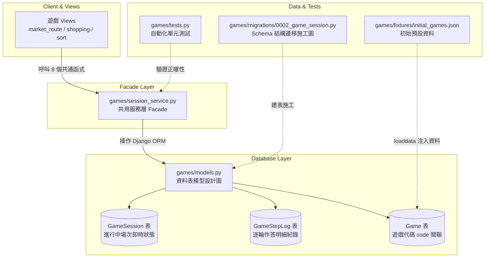

# 遊戲系統 Session 資料庫遷移與共用架構說明

> 專案：憶智防線（LightMemory）  
> 適用範圍：`games/` App（包含 market_route、market_shopping、market_sort、fridge_check 等所有遊戲）  
> 參考依據：《遊戲系統共用資料表規格書》（GameCategory / Game / GameSession / GameRecord）第四節、第五節與第八節  

---

## 📌 目錄

1. [為什麼要進行這次架構遷移？](#1-為什麼要進行這次架構遷移)
2. [檔案架構與各檔案分工角色](#2-檔案架構與各檔案分工角色)
3. [資料表結構（models.py）](#3-資料表結構modelspy)
4. [Session 服務層（session_service.py Facade 設計）](#4-session-服務層session_servicepy-facade-設計)
5. [資料庫遷移（Migration）與初始種子資料（Fixture）](#5-資料庫遷移migration與初始種子資料fixture)
6. [單元測試說明（tests.py）](#6-單元測試說明testspy)
7. [常見問題（FAQ）](#7-常見問題faq)
8. [開發者快速指令指南](#8-開發者快速指令指南)

---

## 1. 為什麼要進行這次架構遷移？

在先前的版本（v1.0）中，遊戲進行中的狀態是儲存在本地的 JSON 檔案中（`games/data/sessions/<game_type>/<id>.json`）。這是一個暫時性方案，方便單機開發與測試。

依照最新規格書第四點與第五點的規劃，團隊正式執行**「刻意架構遷移」**：
* **全面改用關聯式資料庫（PostgreSQL / SQLite）**：將進行中狀態寫入 `GameSession` 資料表，逐題作答紀錄寫入 `GameStepLog` 資料表。
* **維持 Facade 介面不變**：各款遊戲的 `views.py` 完全不需要修改呼叫方式，對外 8 個函式簽名與回傳 dict 形狀維持 100% 相容。
* **解決檔案儲存缺陷**：由資料庫的 ACID 交易機制接管資料併發與保護，不再需要本機暫存檔或檔案鎖（file locking）。

---

## 2. 檔案架構與各檔案分工角色



### 📂 檔案角色清單：

| 檔案路徑 | 角色 | 說明 |
| :--- | :--- | :--- |
| **`games/models.py`** | **資料表設計圖（Schema）** | 定義 `GameSession`、`GameStepLog` 等表格及其欄位型態、外鍵關聯。 |
| **`games/session_service.py`** | **共用服務層（Facade）** | 提供統一的 8 個操作函式，將業務邏輯與底層 ORM 封裝，回傳標準 dict。 |
| **`games/migrations/0002_game_session.py`** | **結構遷移施工單** | 通知資料庫「在實體 DB 建立 `GameSession` 表、`GameStepLog` 表並為 `Game` 新增 `code` 欄位」。 |
| **`games/fixtures/initial_games.json`** | **初始預設資料（Seed Data）** | 以 JSON 格式存放 5 大認知類別與 3 款遊戲的預設資料，透過 `loaddata` 載入。 |
| **`games/tests.py`** | **自動化單元測試** | 驗證 `session_service` 的 8 項功能與異常處理在 0.1 秒內全部正確運作。 |

---

## 3. 資料表結構（models.py）

### 3.1 `GameSession`（進行中場次即時狀態）
對應規格書第四節，取代原先的 JSON 檔案儲存：

| 欄位名稱 | 型別 | 說明 |
| :--- | :--- | :--- |
| `id` | `UUIDField (PK)` | 後端自動生成的唯一場次代碼（UUID4）。 |
| `game` | `ForeignKey(Game)` | 關聯到具體遊戲（透過 `Game.code`）。 |
| `client_session_id` | `CharField(64)` | 前端自產字串代碼（如整理菜籃遊戲自訂之 ID），可為空。 |
| `user` | `ForeignKey(User)` | 遊玩使用者（可為空）。 |
| `status` | `CharField(20)` | `"in_progress"`（進行中）或 `"finished"`（已完成）。 |
| `question_number` | `PositiveIntegerField` | 當前題號（單純累加計數器）。 |
| `current_question` | `JSONField` | 目前這一題的完整題目內容。 |
| `result` | `JSONField` | 整場結束時的彙總計算結果。 |
| `state` | `JSONField` | **遊戲專屬欄位全部放這裡**（如 DDA 難度、連續答對等）。 |
| `is_pretest` | `BooleanField` | **擴充欄位**：是否為前測場次（預設 `False`）。 |
| `avg_response_time_ms`| `PositiveIntegerField` | **擴充欄位**：全場平均反應時間（毫秒），供跨遊戲指標比較。 |
| `created_at` / `updated_at` / `finished_at` | `DateTimeField` | 時間戳記。 |

### 3.2 `GameStepLog`（逐輪作答明細紀錄）
對應規格書第八節，用於完整還原 `step_records`：

| 欄位名稱 | 型別 | 說明 |
| :--- | :--- | :--- |
| `session` | `ForeignKey(GameSession)` | 關聯的場次（`related_name="step_logs"`）。 |
| `step_number` | `PositiveIntegerField` | 第幾輪 / 第幾次嘗試。 |
| `is_correct` | `BooleanField` | 該次作答是否正確。 |
| `response_time_ms` | `PositiveIntegerField` | 該次作答花費的反應時間（毫秒）。 |
| `detail` | `JSONField` | 各遊戲自訂的作答詳細內容（包含玩家選擇、錯誤類型等）。 |

---

## 4. Session 服務層（session_service.py Facade 設計）

對外提供 8 個標準函式，所有函式皆回傳統一格式的 Python dict：

```python
from games import session_service

# 1. 建立新 session（自動生成 UUID）
session = session_service.create_session(game_type, initial_state=None, is_pretest=False)

# 2. 取得或建立 session（支援前端自給 session_id）
session, created = session_service.get_or_create_session(game_type, session_id, initial_state=None, is_pretest=False)

# 3. 讀取單一 session
session = session_service.get_session(game_type, session_id)

# 4. 更新 session 狀態（state 局部合併、欄位更新）
session = session_service.update_session(game_type, session_id, state=None, **fields)

# 5. 附加一筆作答嘗試紀錄（寫入 GameStepLog）
session = session_service.save_step(game_type, session_id, step_record)

# 6. 更新當前題目內容
session = session_service.set_current_question(game_type, session_id, question)

# 7. 結束 session 並存入彙總成績與反應時間
session = session_service.finish_session(game_type, session_id, result, avg_response_time_ms=None)

# 8. 列出該遊戲所有 session
sessions = session_service.list_sessions(game_type)
```

### 回傳 dict 結構（`_to_dict`）：
```json
{
  "session_id": "8f8b8398-...",
  "game_type": "market_shopping",
  "status": "in_progress",
  "question_number": 1,
  "current_question": { ... },
  "step_records": [
    { "step_number": 1, "is_correct": true, "detail": { ... } }
  ],
  "result": null,
  "state": { "difficulty": "easy", "budget": 100 },
  "is_pretest": false,
  "avg_response_time_ms": null
}
```

---

## 5. 資料庫遷移（Migration）與初始種子資料（Fixture）

### 為什麼「建表」與「塞資料」要分開？
* **`0002_game_session.py`（Schema Migration）**：負責「**蓋房子**」（在 DB 建立實體表與索引），是程式碼運作的必要基礎，必須納入版控。
* **`initial_games.json`（Django Fixture）**：負責「**買家具**」（填入預設的 5 大認知類別與 3 款遊戲資料）。使用 JSON 避免了 Data Migration 未來因結構變更而引發的衝突。

---

## 6. 單元測試說明（tests.py）

位於 `games/tests.py`，內含 8 組測試案例覆蓋所有操作：
* `test_create_session`：驗證欄位寫入與 `is_pretest` 狀態。
* `test_get_or_create_session`：驗證自訂 ID 冪等性與 `created` 旗標。
* `test_get_session`：驗證 UUID 與自訂 ID 讀取。
* `test_update_session_and_set_current_question`：驗證 state 局部合併。
* `test_save_step`：驗證 `GameStepLog` 寫入與 `step_records` 反查。
* `test_finish_session`：驗證結算結果與 `finished_at`。
* `test_list_sessions`：驗證列表查詢。
* `test_session_not_found`：驗證異常處理拋出 `SessionNotFound`。

---

## 7. 常見問題（FAQ）

### Q1: 原本的 `SESSION_ROOT_DIR` 和寫入 `.json` 檔案去哪裡了？
> 原先本機的 JSON 檔案讀寫是 v1.0 階段的暫存方案。在本次 v2.0 架構中，已正式由 PostgreSQL / SQLite 資料庫接管，因此不再需要本機目錄讀寫與暫存檔換名。

### Q2: 為什麼 `Game` 模型要新增 `code` 欄位？
> 原先遊戲列表依賴 `game_name`（中文），但文字可能因行銷或調整而變更。新增 `code`（如 `market_route`、`market_shopping`）作為內部唯一識別碼，確保後端業務邏輯穩定不變。

---

## 8. 開發者快速指令指南

```bash
# 1. 執行資料庫遷移（建立 GameSession 與 GameStepLog 表）
python manage.py migrate

# 2. 匯入預設遊戲與類別資料
python manage.py loaddata initial_games.json

# 3. 執行 Session 服務單元測試
python manage.py test games.tests --settings=config.settings_test
```
