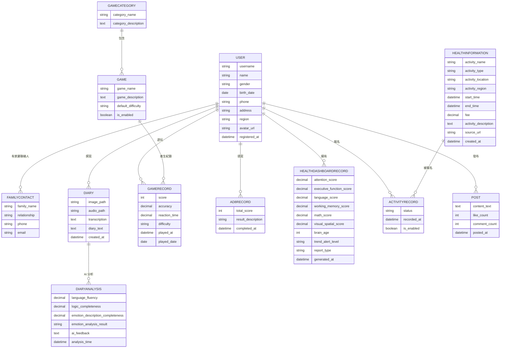

# 憶智防線（LightMemory）

## 目錄

- [專案介紹](#專案介紹)
- [技術清單](#技術清單)
- [專案架構](#專案架構)
- [模組說明](#模組說明)
- [資料庫 ER 圖](#資料庫-er-圖)
- [環境需求](#環境需求)
- [快速開始](#快速開始)
- [Firebase Storage](#firebase-storage)
- [目前開發進度](#目前開發進度)
- [後續開發規劃](#後續開發規劃)

---

## 專案介紹

憶智防線是一套以 AI 為核心的認知健康管理平台。

本系統整合聲影日記、認知遊戲、健康儀表板、資訊加油站、社群互動及 AI 分析等功能，希望協助長者建立日常記錄習慣，並提供家屬長期追蹤認知健康狀態的工具。

---

## 技術清單

| 類別 | 技術 |
|------|------|
| 後端框架 | Django |
| API | Django REST Framework |
| 資料庫 | PostgreSQL |
| 媒體檔案儲存 | Firebase Storage |
| Firebase 串接 | Firebase Admin SDK |
| CORS | django-cors-headers |
| 語言 | Python |
| 版本控制 | Git / GitHub |

> 後續預計加入 Flutter、OpenAI API、Whisper。

---

## 專案架構

```text
LightMemory/
│
├── manage.py
├── requirements.txt
├── README.md
├── DATABASE_SETUP.md
├── FIREBASE_SETUP.md
├── .env.example
├── .gitignore
│
├── config/
│   └── firebase.py
│
├── users/
├── diary/
├── games/
├── dashboard/
├── activities/
├── social/
├── assessments/
├── ai_service/
└── home/
```

> `.env` 與 Firebase Service Account 金鑰屬於私密設定，不會上傳至 GitHub。

---

## 模組說明

| 模組 | 說明 |
|------|------|
| config | Django 專案設定、Firebase 初始化設定 |
| users | 使用者管理（長者、家屬、登入、註冊） |
| diary | 聲影日記、照片、語音與 AI 分析 |
| games | 認知遊戲與遊戲紀錄 |
| dashboard | 健康儀表板與認知趨勢 |
| activities | 資訊加油站與活動推薦 |
| social | 社群分享、留言與互動 |
| assessments | AD-8 及其他認知評估 |
| ai_service | OpenAI、Whisper、AI 分析服務 |
| home | 首頁整合 API |

---

## 資料庫 ER 圖



---

## 環境需求

開始前請確認已安裝：

- Python 3.x
- Git
- PostgreSQL

---

## 快速開始

### 1. Clone Repository

```bash
git clone https://github.com/LightMemory-Team/LightMemory-Backend.git
```

### 2. 進入專案

```bash
cd LightMemory-Backend
```

### 3. 建立虛擬環境

```bash
python -m venv venv
```

### 4. 啟動虛擬環境

Windows：

```powershell
venv\Scripts\activate
```

MacOS：

```bash
source venv/bin/activate
```

### 5. 安裝套件

```bash
pip install -r requirements.txt
```

### 6. 建立 `.env`

複製專案中的：

```text
.env.example
```

建立自己的：

```text
.env
```

並填入 PostgreSQL 與 Firebase 相關設定。

> `.env` 不會上傳至 GitHub。

### 7. 建立資料庫

PostgreSQL 詳細設定方式請參考：

[`DATABASE_SETUP.md`](DATABASE_SETUP.md)

完成設定後執行：

```bash
python manage.py migrate
```

### 8. 設定 Firebase Storage

Firebase Storage 與 Service Account 設定方式請參考：

[`FIREBASE_SETUP.md`](FIREBASE_SETUP.md)

### 9. 啟動 Django

```bash
python manage.py runserver
```

---

## Firebase Storage

本專案使用 Firebase Storage 儲存聲影日記相關的圖片、音訊與影片。

目前 Storage 結構：

```text
voice-diary/
├── images/
├── audio/
└── videos/
```

Firebase 初始化設定位於：

```text
config/firebase.py
```

相關環境變數：

```env
FIREBASE_PROJECT_ID=你的Firebase專案ID
FIREBASE_CREDENTIALS_PATH=secrets/firebase-key.json
FIREBASE_STORAGE_BUCKET=lightmemory-sqlf.firebasestorage.app
```

> Firebase Service Account JSON 為私密憑證，不可上傳至 GitHub。

詳細建置方式請參考 [`FIREBASE_SETUP.md`](FIREBASE_SETUP.md)。

---

## 目前開發進度

### 已完成

- [x] 建立 GitHub Repository
- [x] 建立 Django Project
- [x] 建立 Python Virtual Environment
- [x] 安裝 Django
- [x] 安裝 Django REST Framework
- [x] 安裝 django-cors-headers
- [x] 建立各功能 App
- [x] 設定 Django 基本環境
- [x] 建立 requirements.txt
- [x] 建立 .gitignore
- [x] 設定 PostgreSQL 資料庫
- [x] 建立 Database Models（users、diary、games、dashboard、activities、assessments）
- [x] 首頁（home）API：`user_name`、`daily_tip`、`daily_suggestion`、`games[]`（詳見 [checklist.md](checklist.md)）
- [x] 建立 Firebase Storage
- [x] Django 串接 Firebase Admin SDK
- [x] Firebase Storage Bucket 設定
- [x] 完成 Firebase Storage 圖片上傳測試

---

## 後續開發規劃

- 首頁 API 剩餘欄位：`unread_notification_count`、`wall_posts[]`
- 首頁 4 支獨立 API 整合為一支 `GET /api/home`
- 使用者登入與 JWT 驗證
- 聲影日記 API
- Firebase Storage 與聲影日記 API 正式串接
- AI 分析服務
- 認知遊戲 API
- 健康儀表板 API
- Flutter 前後端串接