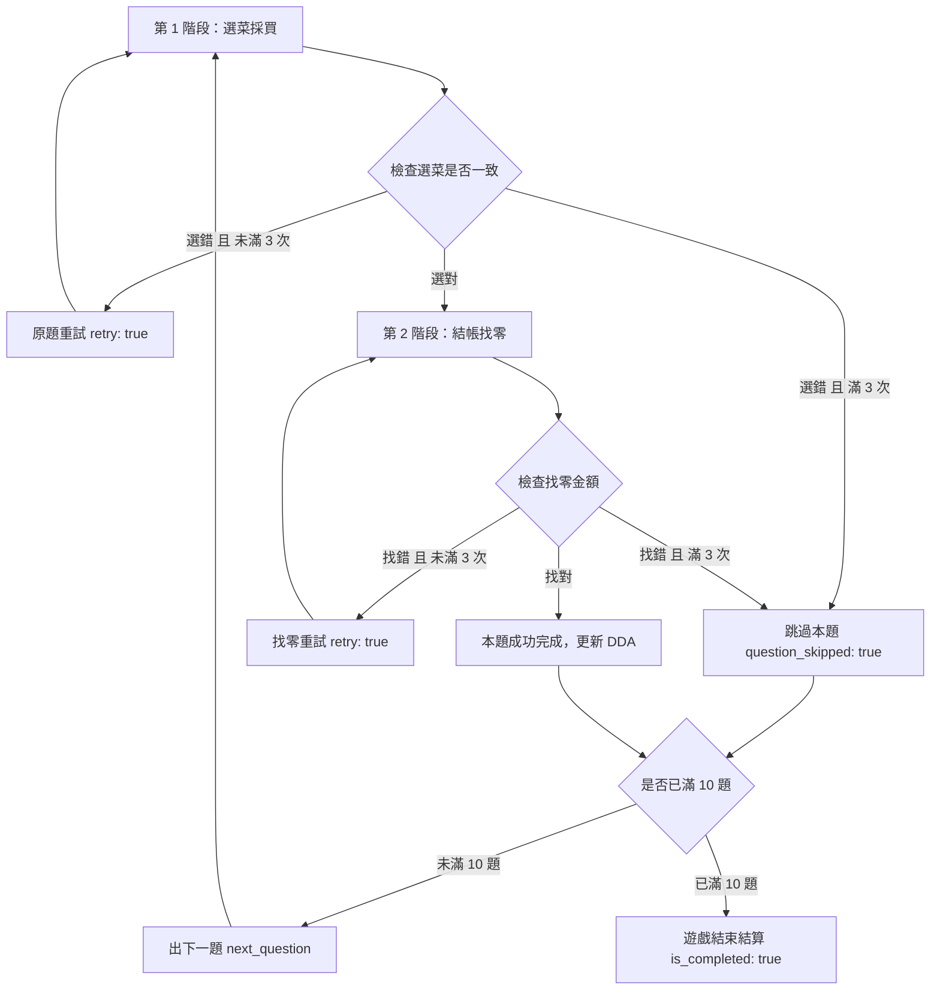
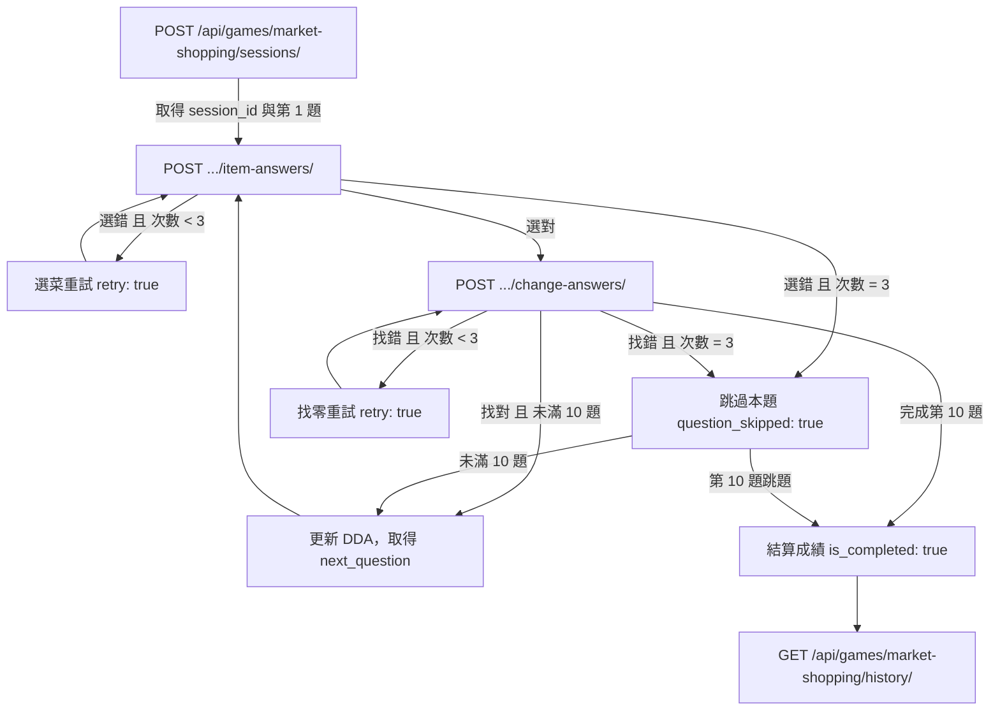

# 市場買菜 — 系統規格書

Oct 04, 2026 · @LightMemory-Backend

遊戲類別：執行功能與數學金錢運算訓練｜遊戲代碼：market_shopping

## 一、玩法總覽

玩法依據執行功能（Executive Function）、工作記憶與生活數學金錢計算能力設計：模擬長者至傳統市場買菜的情境，玩家需在預算範圍內核對購物清單、挑選食材，並完成找零計算。

**單題兩階段作答流程**



1. **第一階段：選菜採買（`submit_item_answer`）**
   - 畫面呈現目標購物清單（`shopping_list`）與市場陳列食材選項（`selection_options`）。
   - 玩家點選欲購買的食材代碼列表（`selected_food_codes`）。
   - 選錯未滿 3 次允許重試；錯滿 3 次跳題；選對進入第二階段。
2. **第二階段：結帳找零（`submit_change_answer`）**
   - 系統依預算金額與花費金額產生 1 個正解與 2 個隨機干擾金額選項（`change_options`）。
   - 玩家點選正確的找零金額（`selected_amount`）。
   - 答對則本題成功完成，進入下一題或第 10 題結算。

## 二、難度三階段與題型設計

遊戲共有 8 種常見市場食材（番茄、雞蛋、豆腐、高麗菜、豬肉、小黃瓜、洋蔥、菠菜），由「清單長度」、「干擾項數量」與「是否主動顯示總額」構成三個階段：

| 階段 | 代碼 | 清單目標數 | 選項總數 | 預算面額 | 總額提示方式 |
| --- | --- | --- | --- | --- | --- |
| 初階 | easy | 2 種食材 | 4 個選項 | 100 / 200 / 300 元 | 系統直接顯示花費總額（`spent_amount`） |
| 中階 | medium | 4 種食材 | 6 個選項 | 100 / 200 / 300 元 | 系統直接顯示花費總額（`spent_amount`） |
| 進階 | hard | 4 種食材 | 6 個選項 | 100 / 200 / 300 元 | **不顯示總額**，玩家需自行加總各食材價格（`purchased_items`）後算找零 |

### 食材庫常數（`FOODS`）

| 食材代碼 (`food_code`) | 食材名稱 (`food_name`) | 價格 (`price`) |
| --- | --- | --- |
| `tomato` | 番茄 | 35 元 |
| `egg` | 雞蛋 | 50 元 |
| `tofu` | 豆腐 | 30 元 |
| `cabbage` | 高麗菜 | 40 元 |
| `pork` | 豬肉 | 80 元 |
| `cucumber` | 小黃瓜 | 30 元 |
| `onion` | 洋蔥 | 20 元 |
| `spinach` | 菠菜 | 35 元 |

## 三、動態難度調整（DDA）規則

整場共 10 題（`TOTAL_QUESTIONS = 10`），初始固定從初階（`easy`）開始。

- **核心架構**：採用 `games.dda` 統一引擎（`DDAConfig` + `NoOpStrategy` + `apply_answer`）。
- **升階門檻**：連續 3 題「一次完整正確」（選菜與找零皆未曾錯誤）即升一階：
  - `easy -> medium`
  - `medium -> hard`
  - `hard` 維持 `hard`
- **中斷連對**：選菜或找零過程中有任何一次答錯，該題連對次數歸零（`correct_streak = 0`），難度維持當前階段不降階。
- **升階回饋**：升階時回傳 `difficulty_upgraded: true`，供前端播放難度升級特效。

## 四、計分邏輯

整場最終成績採 100 分制計算，主要評估「一次完整答對率」與「總答對題數」：

### 1. 正確率（Accuracy Score）
以完全沒有錯誤、一次成功完成的題數（`first_try_correct_count`）計算百分比：

$$\text{accuracy} = \frac{\text{first\_try\_correct\_count}}{\text{total\_questions}} \times 100$$

### 2. 總結算指標
- `total_correct`：總成功完成題數（含重試後完成的題目，滿分 10 題）。
- `first_try_correct_count`：從選菜到找零完全未犯錯之完美題數。
- `accuracy`：一次正確率百分比（`0.0 ~ 100.0`）。
- `final_difficulty`：遊戲結束時所達到的最終難度階段。

## 五、資料表設計

沿用遊戲系統共用架構：`GameSession`（共用場次表）+ `GameStepLog`（逐題明細）。

**GameSession（共用表）**

| 欄位 | 型別 | 說明 |
| --- | --- | --- |
| id | UUID (PK) | 局次唯一識別碼 |
| game | FK → Game | 本遊戲固定關聯至 `code = "market_shopping"` |
| user | FK → User | 使用者 |
| status | varchar(20) | in\_progress / finished / abandoned |
| question\_number | int | 目前題號 (1 ~ 10) |
| current\_question | JSONField | 當前題目目標清單與選項內容 |
| state | JSONField | 進行中即時狀態（含預算、花費、作答次數與 DDA） |
| result | JSONField | 結算後成績摘要 |
| created\_at / finished\_at | datetime | 開始與結束時間戳記 |

**state 內容範例**

```json
{
  "user_id": 1,
  "current_stage": "medium",
  "difficulty": "medium",
  "budget": 200,
  "spent_amount": 155,
  "correct_change": 45,
  "total_correct": 4,
  "first_try_correct_count": 3,
  "correct_streak": 2,
  "consecutive_correct": 2,
  "current_wrong_count": 0,
  "current_question_had_error": false,
  "item_attempt_count": 1,
  "change_attempt_count": 0,
  "item_first_try_correct": true,
  "change_first_try_correct": null
}
```

**result 內容範例（遊戲結束）**

```json
{
  "total_correct": 9,
  "first_try_correct_count": 8,
  "total_questions": 10,
  "accuracy": 80.0,
  "difficulty": "hard",
  "completed_at": "2026-10-04T00:25:30.123456+08:00"
}
```

## 六、API 規格

共 4 支核心 API，統一回傳格式：`{ "success": bool, "data": {...}, "error": null }`，欄位一律 snake\_case。

### 1. POST `/api/games/market-shopping/sessions/`
建立新遊戲局次，並取得第 1 題資料。
*(別名路由支援：`POST /api/games/market-shopping/session/`)*

**Response Body**

```json
{
  "success": true,
  "data": {
    "session_id": "7a8b9c0d-1e2f-3a4b-5c6d-7e8f9a0b1c2d",
    "difficulty": "easy",
    "current_question": 1,
    "total_questions": 10,
    "shopping_list": [
      { "food_code": "tomato", "food_name": "番茄" },
      { "food_code": "egg", "food_name": "雞蛋" }
    ],
    "selection_options": [
      { "food_code": "tomato", "food_name": "番茄" },
      { "food_code": "egg", "food_name": "雞蛋" },
      { "food_code": "tofu", "food_name": "豆腐" },
      { "food_code": "cabbage", "food_name": "高麗菜" }
    ]
  },
  "error": null
}
```

---

### 2. POST `/api/games/market-shopping/sessions/{session_id}/item-answers/`
提交選菜食材代碼列表。
*(別名路由支援：`POST .../sessions/{id}/item-answer/`)*

**Request Body**

```json
{
  "selected_food_codes": ["tomato", "egg"]
}
```

**Response Body（選菜正確，進入找零階段）**

```json
{
  "success": true,
  "data": {
    "is_correct": true,
    "current_question": 1,
    "difficulty": "easy",
    "budget": 200,
    "spent_amount": 85,
    "change_options": [105, 115, 125]
  },
  "error": null
}
```

*(註：若難度為 `hard`，回應中不含 `spent_amount`，改為回傳 `purchased_items` 陣列供玩家自行計算)*

**Response Body（選菜錯誤，重試）**

```json
{
  "success": true,
  "data": {
    "is_correct": false,
    "retry": true,
    "current_question": 1,
    "wrong_count": 1,
    "remaining_attempts": 2
  },
  "error": null
}
```

---

### 3. POST `/api/games/market-shopping/sessions/{session_id}/change-answers/`
提交找零金額答案，由後端執行 DDA 升階與換題。
*(別名路由支援：`POST .../sessions/{id}/change-answer/`)*

**Request Body**

```json
{
  "selected_amount": 115
}
```

**Response Body（找零正確，出下一題）**

```json
{
  "success": true,
  "data": {
    "is_correct": true,
    "is_completed": false,
    "difficulty_upgraded": false,
    "consecutive_correct": 1,
    "total_correct": 1,
    "next_question": {
      "difficulty": "easy",
      "current_question": 2,
      "total_questions": 10,
      "shopping_list": [...],
      "selection_options": [...]
    }
  },
  "error": null
}
```

**Response Body（第 10 題找零正確，結算完成）**

```json
{
  "success": true,
  "data": {
    "is_correct": true,
    "is_completed": true,
    "total_correct": 9,
    "first_try_correct_count": 8,
    "total_questions": 10,
    "accuracy": 80.0,
    "difficulty": "hard",
    "completed_at": "2026-10-04T00:28:15.123456+08:00"
  },
  "error": null
}
```

---

### 4. GET `/api/games/market-shopping/history/`
取得使用者最近 10 場買菜歷史遊玩紀錄（依時間舊到新排序，方便前端折線圖繪製）。

**Response Body**

```json
{
  "success": true,
  "data": [
    {
      "score": 8,
      "accuracy": 80.0,
      "played_at": "2026-10-04T00:28:15.123456+08:00"
    }
  ],
  "error": null
}
```

---

### 錯誤代碼一覽

| code | HTTP status | 說明 | 適用 API |
| --- | --- | --- | --- |
| SESSION\_NOT\_FOUND | 404 | 找不到指定的 session\_id | item-answers, change-answers |
| SESSION\_COMPLETED | 400 | 此遊戲局次已結束，不可重複作答 | item-answers, change-answers |
| INVALID\_ITEM\_ANSWER | 400 | selected\_food\_codes 格式錯誤（非陣列） | item-answers |
| INVALID\_CHANGE\_ANSWER | 400 | selected\_amount 格式錯誤（非整數） | change-answers |
| USER\_NOT\_FOUND | 404 | 查無使用者資訊 | sessions/, history/ |

## 七、API 呼叫順序



## 八、尚待確認與備註事項

- 前端在 `hard` 難度下需呈現 `purchased_items` 各品項單價供使用者計算總額。
- `history/` API 的回傳陣列為由舊到新排序，直接符合前端趨勢圖需求。
- 連續 3 題「選菜與找零一次全對」會觸發升階，`difficulty_upgraded` 設為 `true`。
