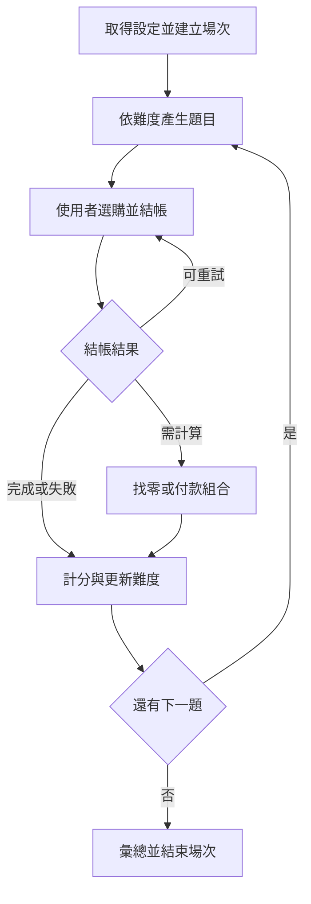

# 市場買菜遊戲算法文件

> 專案：憶智防線（LightMemory）  
> 模組代碼：`market_shopping`  
> 適用範圍：Flutter 前端、Django REST Framework 後端  
> 文件版本：1.0 初稿  
> 文件日期：2026-09-15

## 1. 文件目的

本文件定義「市場買菜」遊戲的核心算法，作為後端出題、結帳驗證、找零判定、計分、動態難度調整（DDA）與場次結算的實作依據。

本文件只描述算法與資料處理規則；資料表完整欄位、API 回傳格式與畫面規格另見《市場買菜遊戲系統規格書》。所有正式判定均由後端執行，前端的即時總額僅供畫面顯示。

## 2. 核心流程



## 3. 固定參數

以下為第一版建議值，正式開發時應集中放在後端設定檔或資料表，不可散落在程式中。

| 參數 | 代碼 | 建議值 |
| --- | --- | ---: |
| 一般場次題數 | `NORMAL_TOTAL_ROUNDS` | 10 |
| 首次前測題數 | `PRETEST_TOTAL_ROUNDS` | 6 |
| 每題結帳上限 | `MAX_CHECKOUT_ATTEMPTS` | 2 |
| 採買限時 | `SHOPPING_TIMEOUT_SECONDS` | 90 |
| 找零限時 | `CHANGE_TIMEOUT_SECONDS` | 30 |
| 升階門檻 | `PROMOTE_STREAK` | 連續 3 題第一次完整成功 |
| 降階門檻 | `DEMOTE_STREAK` | 連續 2 題失敗或逾時 |
| 最低保留預算 | `MIN_REMAINING_BUDGET` | 5 元 |
| 時間誤差容許值 | `TIME_DRIFT_TOLERANCE_MS` | 5,000 ms |

### 3.1 難度設定

| 難度 | 預算 | 清單 | 商品選項 | 價格特性 | 額外任務 | 速度參考值 | 難度係數 |
| --- | --- | --- | --- | --- | --- | ---: | ---: |
| `basic` | 100～130 元 | 2 種商品，各 1 份 | 4 種 | 10 元倍數 | 預算規劃 | 45 秒 | 1.0 |
| `intermediate` | 130～170 元 | 3 種商品，各 1～2 份 | 6 種 | 尾數為 0 或 5 | 找零或指定計算 | 60 秒 | 1.2 |
| `advanced` | 160～200 元 | 4 種商品，可含多份 | 8 種 | 混合價格及包裝價格 | 找零或大小包比較 | 75 秒 | 1.5 |

## 4. 主要資料結構

### 4.1 題目快照 `RoundSnapshot`

```json
{
  "session_id": 701,
  "round_number": 1,
  "stage": "intermediate",
  "budget": 160,
  "shopping_list": [
    {"item_id": 3, "name": "雞蛋", "quantity": 1}
  ],
  "product_options": [
    {
      "option_id": 31,
      "item_id": 3,
      "name": "雞蛋",
      "unit_price": 45,
      "package_quantity": 1,
      "unit_label": "盒"
    }
  ],
  "requires_change": true,
  "requires_package_compare": false,
  "accepted_combinations": [[{"option_id": 31, "quantity": 1}]],
  "started_at": "2026-09-15T13:00:00Z"
}
```

`accepted_combinations` 只存於後端快照，不回傳前端，用來處理大小包價格並列或多種正確購買組合。

### 4.2 使用者菜籃 `SelectedItem`

```json
{
  "option_id": 31,
  "quantity": 1
}
```

前端只送出 `option_id` 與 `quantity`。商品名稱、單價、總額與答案不可由前端決定。

### 4.3 單題結果 `RoundResult`

```json
{
  "is_correct": true,
  "checkout_attempt": 1,
  "list_complete": true,
  "has_extra_items": false,
  "within_budget": true,
  "package_compare_correct": null,
  "change_correct": true,
  "is_timeout": false,
  "active_time_ms": 48200,
  "score_earned": 120,
  "dda_action": "keep"
}
```

## 5. 算法一：建立場次

### 5.1 輸入

- 已驗證的 `user_id`
- `UserGameState`：是否完成前測、目前難度

### 5.2 輸出

- `session_id`
- `is_pretest`
- `current_stage`
- `total_rounds`
- 場次到期時間

### 5.3 規則

1. 使用者未完成前測時，建立 6 題前測場次。
2. 前測題目順序為 `basic × 2 → intermediate × 2 → advanced × 2`，前測中不啟用 DDA。
3. 已完成前測時，沿用 `UserGameState.current_stage` 建立 10 題一般場次。
4. 同一使用者若已有未過期的 `playing` 場次，回傳原場次，不重複建立。

### 5.4 偽程式碼

```text
function start_session(user):
    state = get_or_create_user_game_state(user, "market_shopping")

    active_session = find_active_session(user)
    if active_session exists and not expired(active_session):
        return active_session

    if state.pretest_completed is false:
        is_pretest = true
        current_stage = "basic"
        total_rounds = 6
    else:
        is_pretest = false
        current_stage = state.current_stage
        total_rounds = 10

    session = create_session_atomically(
        user=user,
        is_pretest=is_pretest,
        current_stage=current_stage,
        total_rounds=total_rounds,
        status="playing"
    )
    return session
```

## 6. 算法二：產生採買題目

### 6.1 輸入

- `session_id`
- `round_number`
- 本題難度 `stage`
- 啟用中的商品資料
- 同場最近使用過的清單與商品

### 6.2 輸出

- 預算
- 購物清單
- 商品選項
- 正確購買組合
- 是否包含找零或大小包比較

### 6.3 產題限制

1. 正確購買組合的總額必須小於或等於預算。
2. 正確組合至少保留 5 元預算，避免出現只有單一數字巧合的無解題。
3. 商品選項不可重複 `option_id`。
4. 清單商品必須全部存在於商品選項。
5. 干擾商品不得同時形成比正確答案更合理、但未列入答案的組合。
6. 同一場不得連續兩題使用完全相同的購物清單。
7. 大小包題至少提供兩種有效包裝方案。
8. 最低成本若並列，所有最低成本組合都必須加入 `accepted_combinations`。
9. 產題失敗時最多重新抽樣 50 次；仍失敗則改用固定題庫。

### 6.4 偽程式碼

```text
function generate_round(session, round_number, stage):
    config = DIFFICULTY_CONFIG[stage]

    if session.is_pretest:
        stage = [basic, basic, intermediate, intermediate, advanced, advanced]
                [round_number - 1]

    repeat up to 50 times:
        targets = sample_distinct_products(config.list_item_count)
        shopping_list = assign_required_quantities(targets, config.quantity_rule)
        correct_options = choose_valid_options(targets, stage)
        correct_total = calculate_total(correct_options, shopping_list)

        budget = sample_budget(config.budget_min, config.budget_max)
        if correct_total > budget - MIN_REMAINING_BUDGET:
            continue

        distractors = sample_distractors(
            exclude=correct_options,
            count=config.option_count - len(correct_options)
        )
        product_options = shuffle(correct_options + distractors)

        accepted = find_all_valid_combinations(
            shopping_list,
            product_options,
            budget,
            require_lowest_cost=(stage == advanced and is_package_question)
        )

        if accepted is empty:
            continue
        if same_as_recent_round(shopping_list, session):
            continue

        snapshot = build_round_snapshot(...)
        save_snapshot(snapshot)
        return snapshot_without_answers(snapshot)

    return load_fixed_question(stage)
```

### 6.5 正確組合搜尋

將每個清單品項可使用的包裝視為候選集合，以深度優先搜尋或笛卡兒積列舉組合。第一版每題最多 8 個商品選項，因此可採窮舉法，實作簡單且運算量可控。

```text
function find_all_valid_combinations(list, options, budget, require_lowest_cost):
    candidates = enumerate_combinations_that_meet_required_quantities(list, options)
    candidates = filter(total_cost(candidate) <= budget, candidates)

    if require_lowest_cost:
        minimum = min(total_cost(candidate) for candidate in candidates)
        candidates = filter(total_cost(candidate) == minimum, candidates)

    return normalize_and_deduplicate(candidates)
```

## 7. 算法三：前端即時總額

此算法由前端執行，只負責即時顯示，不作為正式結帳依據。

```text
function calculate_display_total(selected_items, product_options):
    total = 0
    for selected in selected_items:
        option = product_options[selected.option_id]
        total = total + option.unit_price * selected.quantity
    return total
```

前端每次加一、減一或移除商品後重新計算。數量減至 0 時應從菜籃移除該項目。

## 8. 算法四：結帳驗證

### 8.1 輸入

- `session_id`
- `round_number`
- `attempt_number`
- `selected_items`
- 計時及暫停資訊

### 8.2 驗證順序

1. 驗證場次屬於目前登入使用者且狀態為 `playing`。
2. 驗證 `round_number` 為目前題目。
3. 驗證 `attempt_number` 為 1 或 2，且未超過上限。
4. 驗證每個 `option_id` 屬於本題快照。
5. 驗證 `quantity` 為 0 以上整數。
6. 合併重複的 `option_id`，數量為 0 的項目移除。
7. 使用後端題目快照中的單價重算總額。
8. 比對清單、額外商品、預算與包裝組合。

### 8.3 判定定義

- `list_complete`：每個清單品項的實際總數量都等於需求數量。
- `has_extra_items`：菜籃含有清單以外品項，或任一品項超過需求數量。
- `within_budget`：後端重算總額小於或等於本題預算。
- `package_compare_correct`：標準化後的菜籃符合任一 `accepted_combinations`。
- `checkout_passed`：以上必要條件全部成立。

### 8.4 偽程式碼

```text
function validate_checkout(snapshot, selected_items, attempt_number):
    selected = normalize_selected_items(selected_items)
    assert every option_id exists in snapshot.product_options
    assert every quantity is a non_negative_integer

    total_cost = 0
    actual_by_item = empty_counter()

    for selected_item in selected:
        option = snapshot.product_options[selected_item.option_id]
        total_cost += option.unit_price * selected_item.quantity
        actual_by_item[option.item_id] += (
            option.package_quantity * selected_item.quantity
        )

    required_by_item = counter(snapshot.shopping_list)
    list_complete = every actual_by_item[id] == required_by_item[id]
    has_extra_items = any id not required or actual_by_item[id] > required_by_item[id]
    within_budget = total_cost <= snapshot.budget

    if snapshot.requires_package_compare:
        package_correct = matches_any_accepted_combination(selected)
    else:
        package_correct = true

    checkout_passed = (
        list_complete
        and not has_extra_items
        and within_budget
        and package_correct
    )

    if checkout_passed:
        action = "change_question" if snapshot.requires_change else "next_round"
    else if attempt_number < MAX_CHECKOUT_ATTEMPTS:
        action = "retry"
    else:
        action = "next_round"

    return validation_result(..., action=action)
```

### 8.5 回饋原則

第一次失敗可回傳以下分類提示，但不可直接揭露完整答案：

- `missing_items`：缺少的品項名稱，不提供應買哪個商品選項。
- `extra_items`：多買的品項。
- `over_budget=true`：提醒超過預算，不回傳最低成本組合。
- `package_compare_correct=false`：提醒重新比較包裝數量與價格。

第二次仍失敗時，結束本題並回傳正確購買組合及簡短說明。

## 9. 算法五：找零與付款組合

### 9.1 題型 A：找零金額 `change_amount`

系統提供應付金額與付款金額，使用者選擇應找回的金額。

```text
expected_change = payment_amount - total_cost
is_correct = integer(user_answer) == expected_change
```

限制：

- `payment_amount >= total_cost`。
- `payment_amount` 必須能由新臺幣面額組成。
- 答案與干擾選項皆為非負整數，且不可重複。
- 建議以常見錯誤產生干擾值，例如少 5 元、多 5 元或減法位數錯誤。

### 9.2 題型 B：付款組合 `banknote_combination`

系統提供應付金額，使用者選擇硬幣或鈔票數量，使總和剛好等於應付金額。

```text
TWD_DENOMINATIONS = [1, 5, 10, 50, 100, 500, 1000]

function validate_payment_combination(answer, total_cost):
    assert every denomination belongs to TWD_DENOMINATIONS
    assert every count is a non_negative_integer

    paid = sum(denomination * count for each answer item)
    return paid == total_cost
```

### 9.3 找零題提交

```text
function submit_change_answer(snapshot, answer, active_time_ms, is_timeout):
    if is_timeout:
        is_correct = false
    else if snapshot.answer_type == "change_amount":
        is_correct = integer(answer) == snapshot.expected_change
    else:
        is_correct = validate_payment_combination(answer, snapshot.total_cost)

    explanation = build_short_calculation_explanation(snapshot)
    return {is_correct, correct_answer, explanation}
```

找零階段第一版只作答一次；答錯或超時後顯示算法與正確答案，接著進入下一題。

## 10. 算法六：有效作答時間與逾時

後端以 `round_started_at` 與收到答案的時間為主要依據；前端回傳值只用來扣除合法暫停時間及協助偵錯。

```text
function calculate_active_time(round_started_at, received_at,
                               client_active_ms, paused_duration_ms):
    server_elapsed_ms = received_at - round_started_at
    verified_pause_ms = clamp(paused_duration_ms, 0, server_elapsed_ms)
    server_active_ms = max(0, server_elapsed_ms - verified_pause_ms)

    if abs(server_active_ms - client_active_ms) <= TIME_DRIFT_TOLERANCE_MS:
        return client_active_ms
    else:
        return server_active_ms
```

逾時判定：

```text
shopping_timeout = active_time_ms > SHOPPING_TIMEOUT_SECONDS * 1000
change_timeout = active_time_ms > CHANGE_TIMEOUT_SECONDS * 1000
```

App 進入背景時，前端暫停倒數並累計 `paused_duration_ms`。活動狀態最多保留 2 小時，逾期場次標記為 `abandoned`。

## 11. 算法七：單題計分

### 11.1 基礎分

| 項目 | 分數 |
| --- | ---: |
| 第一次結帳成功 | 70 |
| 第二次結帳成功 | 50 |
| 最終失敗或逾時 | 0 |
| 計算任務正確 | 20 |
| 低於速度參考值 | 10 |

### 11.2 計算規則

```text
function calculate_round_score(stage, checkout_attempt, checkout_passed,
                               calculation_correct, active_time_ms, is_timeout):
    if is_timeout or not checkout_passed:
        checkout_score = 0
    else if checkout_attempt == 1:
        checkout_score = 70
    else:
        checkout_score = 50

    if stage == "basic":
        calculation_score = 20 if checkout_passed else 0
    else:
        calculation_score = 20 if calculation_correct else 0

    reference_ms = SPEED_REFERENCE_SECONDS[stage] * 1000
    round_complete = checkout_passed and (
        stage == "basic" or calculation_correct is not false
    )
    speed_score = 10 if round_complete and active_time_ms <= reference_ms else 0

    raw_score = checkout_score + calculation_score + speed_score
    return round_half_up(raw_score * DIFFICULTY_COEFFICIENT[stage])
```

計分不倒扣，也不進行不同使用者之間的排名。四捨五入採 `ROUND_HALF_UP`，避免不同語言預設捨入方式造成結果不一致。

## 12. 算法八：動態難度調整（DDA）

### 12.1 狀態值

- `current_stage`
- `success_streak`
- `failure_streak`

### 12.2 成功與失敗定義

- 第一次完整成功：第一次結帳通過，且本題需要的找零或大小包任務也正確。
- 失敗：第二次結帳仍未通過、計算任務答錯或本題逾時。
- 第二次結帳成功：本題完成，但不累積升階連勝；同時將失敗連續值歸零。

### 12.3 偽程式碼

```text
STAGES = ["basic", "intermediate", "advanced"]

function update_dda(session, round_result):
    if session.is_pretest:
        return {action: "keep", stage: round_result.stage}

    if round_result.first_try_full_success:
        session.success_streak += 1
        session.failure_streak = 0
    else if round_result.is_failed or round_result.is_timeout:
        session.failure_streak += 1
        session.success_streak = 0
    else:
        session.success_streak = 0
        session.failure_streak = 0

    if session.success_streak >= 3 and session.current_stage != "advanced":
        session.current_stage = next_stage(session.current_stage)
        session.success_streak = 0
        session.failure_streak = 0
        action = "promote"
    else if session.failure_streak >= 2 and session.current_stage != "basic":
        session.current_stage = previous_stage(session.current_stage)
        session.success_streak = 0
        session.failure_streak = 0
        action = "demote"
    else:
        action = "keep"

    save_session_state(session)
    return {action, stage: session.current_stage}
```

DDA 只在本題完全結束後影響下一題，不可在同一題的第二次結帳或找零階段中途改變規則。

## 13. 算法九：前測起始難度

前測固定完成初階、中階、高階各 2 題，不使用連勝／連敗算法。

```text
function decide_stage_from_pretest(results):
    basic_success = count_success(results, "basic")
    intermediate_success = count_success(results, "intermediate")
    advanced_success = count_success(results, "advanced")

    if intermediate_success == 2 and advanced_success >= 1:
        return "advanced"
    else if basic_success == 2 and intermediate_success >= 1:
        return "intermediate"
    else:
        return "basic"
```

前測完成後，將結果寫入 `UserGameState.current_stage`，並將 `pretest_completed` 設為 `true`。

## 14. 算法十：場次結算

場次結束時只使用已寫入的逐題紀錄彙總，不接受前端自行計算的總分或正確率。

```text
function finish_session(session_id):
    session = lock_session_for_update(session_id)
    if session.status == "finished":
        return previously_saved_summary(session)

    logs = get_final_round_logs(session_id)
    completed_rounds = count(logs)
    correct_rounds = count(log.is_correct == true)
    first_try_correct = count(log.first_try_full_success == true)
    timeout_count = count(log.is_timeout == true)
    total_score = sum(log.score_earned)

    accuracy = safe_divide(correct_rounds, completed_rounds)
    change_accuracy = safe_divide(
        count(log.change_correct == true),
        count(log.requires_change == true)
    )
    avg_response_time_ms = average(
        log.active_time_ms where log.is_timeout == false
    )

    if session.is_pretest:
        final_stage = decide_stage_from_pretest(logs)
    else:
        final_stage = session.current_stage

    save_summary_atomically(...)
    update_user_game_state(final_stage)
    mark_session_finished()
    return summary
```

`safe_divide` 的分母為 0 時回傳 `null`，不回傳無限值或引發例外。

## 15. 重複送出與資料一致性

### 15.1 冪等鍵

逐次結帳使用以下組合作為唯一鍵：

```text
(session_id, round_number, attempt_number)
```

找零答案使用：

```text
(session_id, round_number, "change_answer")
```

收到相同鍵的重複請求時，直接回傳第一次儲存的結果，不重算分數、不重複更新 DDA。

### 15.2 交易範圍

下列操作必須在同一個資料庫 transaction 中完成：

1. 鎖定場次與目前題目。
2. 驗證題號及嘗試次數。
3. 寫入結帳或找零紀錄。
4. 更新題目狀態。
5. 寫入分數。
6. 更新 DDA 狀態。

建議使用 Django `transaction.atomic()` 搭配 `select_for_update()`，避免使用者連點或網路重送造成跳題與重複計分。

## 16. API 與算法對照

| API | 呼叫算法 |
| --- | --- |
| `GET /api/games/market-shopping/config/` | 讀取固定參數與前測狀態 |
| `POST /api/games/market-shopping/start/` | 算法一：建立場次 |
| `GET /api/games/market-shopping/round/` | 算法二：產生採買題目 |
| `POST /api/games/market-shopping/round/checkout/` | 算法四、六：結帳與時間驗證 |
| `POST /api/games/market-shopping/round/change-answer/` | 算法五、六、七、八 |
| `POST /api/games/market-shopping/finish/` | 算法九、十：前測或一般場結算 |
| `GET /api/games/market-shopping/result/{session_id}/` | 讀取既有彙總結果 |

## 17. 錯誤碼

| 錯誤碼 | HTTP | 使用時機 |
| --- | ---: | --- |
| `SESSION_NOT_FOUND` | 404 | 場次不存在或不屬於使用者 |
| `SESSION_FINISHED` | 409 | 場次已經結束 |
| `ROUND_MISMATCH` | 409 | 題號不是後端目前題目 |
| `INVALID_ITEM` | 400 | 商品不屬於本題選項 |
| `INVALID_QUANTITY` | 400 | 數量不是 0 以上整數 |
| `ATTEMPT_LIMIT_REACHED` | 409 | 已超過本題結帳次數 |
| `CHANGE_NOT_REQUIRED` | 409 | 本題未進入找零階段 |
| `DUPLICATE_REQUEST` | 409 | 相同冪等鍵但請求內容不同 |
| `VALIDATION_ERROR` | 400 | 其他欄位格式錯誤 |

## 18. 最低測試案例

| 編號 | 測試情境 | 預期結果 |
| --- | --- | --- |
| A01 | 清單完整且總額未超過預算 | 結帳通過 |
| A02 | 少買一項商品 | 回 `retry` 與 `missing_items` |
| A03 | 多買清單外商品 | 回 `retry` 與 `extra_items` |
| A04 | 前端竄改單價或總額 | 後端忽略並依快照重算 |
| A05 | 第二次結帳仍失敗 | 本題 0 分並進行 DDA |
| A06 | 連續 3 題第一次完整成功 | 下一題升一階 |
| A07 | 連續 2 題失敗或逾時 | 下一題降一階 |
| A08 | 付款 200 元、應付 135 元、回答 65 元 | 找零正確 |
| A09 | 重複送出相同結帳請求 | 回傳原結果，不重複計分 |
| A10 | 相同冪等鍵但內容不同 | 回 `DUPLICATE_REQUEST` |
| A11 | 切到背景 30 秒後回來 | 扣除合法暫停時間 |
| A12 | 高階大小包最低價並列 | 所有最低價有效組合皆通過 |
| A13 | 第 10 題完成 | 回 `finished`，可執行場次結算 |
| A14 | 首次使用完成 6 題前測 | 計算並儲存下次起始難度 |

## 19. 第一版開發順序

1. 先以 3 題固定題庫完成 `round` 與 `checkout` 串接。
2. 完成菜籃重試、時間及重複送出處理。
3. 完成逐題紀錄、`finish` 與結果頁資料。
4. 加入找零題與中階題。
5. 加入前測與 DDA。
6. 最後加入高階大小包比較與隨機產題。

## 20. 開發前待確認

- 一般場 10 題、前測 6 題是否符合預計遊戲時長。
- 採買 90 秒、找零 30 秒是否需依長者測試結果放寬。
- 第一版找零先實作「找零金額」或「付款組合」。
- 大小包比較是否列入第一版。
- 正式環境的活動狀態使用 Redis，或先使用 Django cache。
- 商品圖片由 Flutter assets 或 Firebase Storage 提供。

