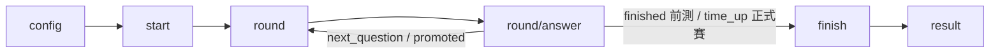

#  煮菜過程— 系統規格書

Sep 21, 2026 · @Someone

遊戲類別：記憶訓練（參考 Delayed Matching to Sample，延遲配對記憶測驗）｜遊戲代碼：memory\_recall

## 一、玩法總覽

玩法依據 Delayed Matching to Sample（延遲配對記憶）認知科學原理設計：先顯示一個物品要求記住，經過一段延遲後，畫面出現數張選項卡片，玩家需選出剛剛看到的是哪一張。

**單輪流程**

1. 記憶階段：顯示目標物品（`target_item`），持續 `memorize_time_ms`
2. 延遲階段：畫面空白或等待，持續 `delay_ms`
3. 回想階段：顯示選項卡片（`option_items`，含正解），玩家點選
4. 系統判定對錯，進入下一輪

答錯不提供重試，直接進入下一輪（記憶類遊戲的重點是「有沒有真的記住」，重試會讓玩法變成測驗猜測策略而非記憶力）。

## 二、難度三階段與物品庫

難度由「物品彼此的相似程度」構成三個階段，元素量（每階段可出題的物品種類數）皆為 3。

| 階段 | 代碼 | 分類方式 | 範例 | 元素量 |
| --- | --- | --- | --- | --- |
| 初階 | basic | 蔬菜種類 | 馬鈴薯、胡蘿蔔、洋蔥 | 3 |
| 中階 | intermediate | 調味料顏色 | 鹽巴（白）、黑糖（咖啡）、味精 | 3 |
| 高階 | advanced | 形狀（同類型分組） | 馬鈴薯泥／塊／絲、紅蘿蔔泥／塊／絲 | 3（每組） |

**每一輪的選項卡片，即為該階段固定的 3 個物品全部秀出來（含正解）**，不需另外設計干擾項篩選邏輯。

高階物品庫需依「同類型分組」，後端出題時須先隨機選定一個類型組，再從組內固定 3 個型態出題（前端組負責圖片素材）。

## 三、前測設計

使用者首次玩此遊戲，固定跑前測，記錄基準值。

- 固定 **4 輪**，跑完自動結束（非計時制）
- 全程固定初階（蔬菜種類），**不啟用升階**
- **不計分**，前端不顯示分數；後端仍可計算 `total_score` 供內部分析，但不回傳給前端呈現
- 產出：正確率（`accuracy`）、平均反應時間（`avg_response_time_ms`）作為基準值

單輪流程與正式賽相同（記憶階段 → 延遲 → 回想作答），差別僅在結束條件與是否升階、計分。

## 四、正式賽計時與升階規則

**計時制**：基礎時長 60 秒，時間到自動結束，時間內答越多題越好。

⚠️ **時間須由後端當唯一真相來源**：`start/` 時後端計算 `expires_at`（到期時間戳記），之後每次 `round/answer/` 由後端比對當下時間與 `expires_at`；前端倒數畫面僅供顯示，不作為判定依據，避免裝置計時誤差或竄改導致遊戲時間失真。

**升階規則**

- 連對 3 題（`promote_streak`）→ 升階
- 每次升階獎勵 **+15 秒**（`promote_bonus_seconds`），由後端直接延長 `expires_at`
- 因不設計降階，一場遊戲最多升階 2 次（basic→intermediate、intermediate→advanced），故最多可獲得 2×15=30 秒額外時間，遊戲時長上限 90 秒
- **不設計降階**：時間有限，答錯以不加分處理，不讓玩家掉回前一階段浪費時間

升階門檻（連對 3 題）為建議起始值，待長者測試後校準。

## 五、計分邏輯

**單題得分 = 基礎分 × 難度係數**

| 結果 | 基礎分 |
| --- | --- |
| 答對 | 10 分 |
| 答錯 | 0 分（不倒扣） |

| 階段 | 難度係數 |
| --- | --- |
| basic | ×1.0 |
| intermediate | ×1.3 |
| advanced | ×1.6 |

**單場總分 = 所有答對題目的單題得分加總**

不設計速度加成：計時制下「快」已直接反映在時間內可作答題數上，重複計算會讓分數失真且公式複雜化。

前測不計算此分數給前端顯示（見第三節）。

## 六、資料表設計

沿用三款菜市場遊戲共用的架構：`GameSession`（共用基礎表）+ `GameStepLog`（逐輪明細）。

**GameSession（共用表，所有遊戲共用）**

| 欄位 | 型別 | 說明 |
| --- | --- | --- |
| id | UUID (PK) | 主鍵，避免用猜測的 ID 存取他人資料（IDOR） |
| game\_type | varchar(50) | 本遊戲固定 `memory_recall` |
| user | FK → users | 使用者 |
| status | varchar(20) | in\_progress / finished / abandoned |
| is\_pretest | bool | 是否為前測 |
| state | JSONField | 進行中暫存資料 |
| result | JSONField | 結算後統計結果 |
| avg\_response\_time\_ms | int | 平均反應時間 |
| created\_at / finished\_at | datetime |  |

**state 內容範例**

```json
{
  "current_stage": "advanced",
  "correct_streak": 1,
  "round_index": 22,
  "expires_at": "2026-09-22T10:15:30Z"
}
```

**result 內容範例（正式賽）**

```json
{
  "total_rounds": 22,
  "total_correct": 18,
  "total_wrong": 4,
  "final_stage": "advanced",
  "total_bonus_seconds": 30,
  "total_score": 214
}
```

**GameStepLog（逐輪明細）**

| 欄位 | 型別 | 說明 |
| --- | --- | --- |
| session | FK → GameSession | 屬於哪一場 |
| step\_number | int | 第幾輪 |
| is\_correct | bool |  |
| response\_time\_ms | int |  |
| detail | JSONField | 見下方範例 |

**detail 內容範例（高階需記錄分組）**

```json
{
  "stage": "advanced",
  "group": "馬鈴薯組",
  "target_item": "馬鈴薯泥",
  "option_items": ["馬鈴薯泥", "馬鈴薯塊", "馬鈴薯絲"],
  "selected_item": "馬鈴薯塊"
}
```

## 七、API 規格

共 6 支，統一回傳格式：`{ "success": bool, "data": {...}, "error": ... }`，欄位一律 snake\_case。

### 1. GET `/api/games/memory-recall/config/`

| 欄位 | 型別 | 範例值 | 說明 |
| --- | --- | --- | --- |
| is\_pretest | bool | false |  |
| current\_stage | string | "basic" |  |
| pretest\_total\_rounds | int | 4 | 前測固定輪數 |
| base\_time\_limit\_seconds | int | 60 | 正式賽時長，前測不使用 |
| promote\_streak | int | 3 | 連對幾題升階 |
| promote\_bonus\_seconds | int | 15 | 每次升階獎勵秒數 |
| stage\_item\_pools | object | 見第二節範例 | 各階段物品庫 |

### 2. POST `/api/games/memory-recall/start/`

| 欄位 | 型別 | 範例值 | 說明 |
| --- | --- | --- | --- |
| session\_id | uuid | ... | 後續各 API 都要帶 |
| is\_pretest | bool | true |  |
| current\_stage | string | "basic" |  |
| expires\_at | datetime\|null | null（前測時） | 正式賽才有值 |

### 3. GET `/api/games/memory-recall/round/`

| 欄位 | 型別 | 範例值 | 說明 |
| --- | --- | --- | --- |
| round\_number | int | 5 |  |
| stage | string | "advanced" |  |
| target\_item | string | "馬鈴薯泥" |  |
| memorize\_time\_ms | int | 1200 |  |
| delay\_ms | int | 1000 |  |
| option\_items | array | \["馬鈴薯泥","馬鈴薯塊","馬鈴薯絲"\] | 該階段/該組全部 3 個元素，隨機排序 |

### 4. POST `/api/games/memory-recall/round/answer/`

**送出**

| 欄位 | 型別 | 說明 |
| --- | --- | --- |
| session\_id | uuid |  |
| round\_number | int |  |
| selected\_item | string |  |
| response\_time\_ms | int |  |

**回傳**

| 欄位 | 型別 | 範例值 | 說明 |
| --- | --- | --- | --- |
| is\_correct | bool | true |  |
| action | string | "promoted" | next\_question / promoted / finished（前測）/ time\_up（正式賽） |
| current\_stage | string | "advanced" |  |
| correct\_streak | int | 0 | 升階後歸零 |
| bonus\_seconds\_granted | int | 15 | 觸發升階才有值，否則 0 |
| expires\_at | datetime | ... | 有 bonus 時為延長後的新到期時間 |
| score\_earned | int | 13 | 前測恆為 0 或不回傳 |

**範例（觸發升階）**

送出：

```json
{
  "session_id": "3f2a9c1e-5b7d-4e8a-9c21-7d4e5f6a8b90",
  "round_number": 9,
  "selected_item": "馬鈴薯泥",
  "response_time_ms": 1380
}
```

回傳：

```json
{
  "success": true,
  "data": {
    "is_correct": true,
    "action": "promoted",
    "current_stage": "advanced",
    "correct_streak": 0,
    "bonus_seconds_granted": 15,
    "expires_at": "2026-09-22T10:16:12Z",
    "score_earned": 13
  },
  "error": null
}
```

**範例（一般答錯，正式賽）**

回傳：

```json
{
  "success": true,
  "data": {
    "is_correct": false,
    "action": "next_question",
    "current_stage": "intermediate",
    "correct_streak": 0,
    "bonus_seconds_granted": 0,
    "expires_at": "2026-09-22T10:15:57Z",
    "score_earned": 0
  },
  "error": null
}
```

### 5. POST `/api/games/memory-recall/finish/`

| 欄位 | 型別 | 範例值 | 說明 |
| --- | --- | --- | --- |
| total\_rounds | int | 22 | 前測固定 4 |
| total\_correct | int | 18 |  |
| total\_wrong | int | 4 |  |
| accuracy | float | 0.82 |  |
| avg\_response\_time\_ms | int | 2100 |  |
| final\_stage | string | "advanced" | 前測恆為 basic |
| total\_bonus\_seconds | int | 30 | 前測不適用，可為 0 |
| total\_score | int\|null | 214 | 前測為 null，不回傳給前端顯示 |

### 6. GET `/api/games/memory-recall/result/{session_id}/`

彙總 `finish/` 的所有欄位，供儀表板或回顧使用。

### 錯誤代碼一覽

沿用共用的錯誤檢查邏輯（`get_session_for_request`），`error` 固定含 `code` + `message`。

| code | HTTP status | 說明 | 適用 API |
| --- | --- | --- | --- |
| SESSION\_NOT\_FOUND | 404 | 找不到指定的 session\_id | round / round/answer / finish / result |
| FORBIDDEN | 403 | 該 session 不屬於這位使用者 | round / round/answer / finish / result |
| SESSION\_ALREADY\_FINISHED | 409 | 這場遊戲已經結束，不可再作答 | round / round/answer |
| ROUND\_MISMATCH | 400 | 送出的 round\_number 與後端目前記錄的輪數不一致 | round/answer |
| INVALID\_ITEM | 400 | selected\_item 不在該輪 option\_items 之中 | round/answer |
| GAME\_TIME\_UP | 410 | 正式賽時間已到期，仍嘗試作答 | round/answer |

**範例（session 已結束仍嘗試作答）**

```json
{
  "success": false,
  "data": null,
  "error": {
    "code": "SESSION_ALREADY_FINISHED",
    "message": "這場遊戲已經結束了"
  }
}
```

**範例（找不到 session）**

```json
{
  "success": false,
  "data": null,
  "error": {
    "code": "SESSION_NOT_FOUND",
    "message": "找不到指定的 session"
  }
}
```

## 八、API 呼叫順序



前測：`finished` 於第 4 輪答完後觸發。正式賽：`time_up` 於後端判定 `expires_at` 已過期時觸發，或玩家中途離開時由前端主動呼叫 `finish/`。

## 九、尚待確認事項

- 高階物品庫的分組資料結構（`groups` 陣列）與前端組確認實際圖片素材如何對應
- 升階門檻（連對 3 題）、時間獎勵（15 秒）是否合適，待長者測試後校準
- 前測固定 4 輪，樣本數較小，正確率基準值可能有雜訊，視測試結果評估是否調整輪數
- 前測與正式賽物品庫是否重疊（皆從初階蔬菜種類開始），會不會讓正式賽一開始就有印象、影響「測基準」的獨立性，待討論
